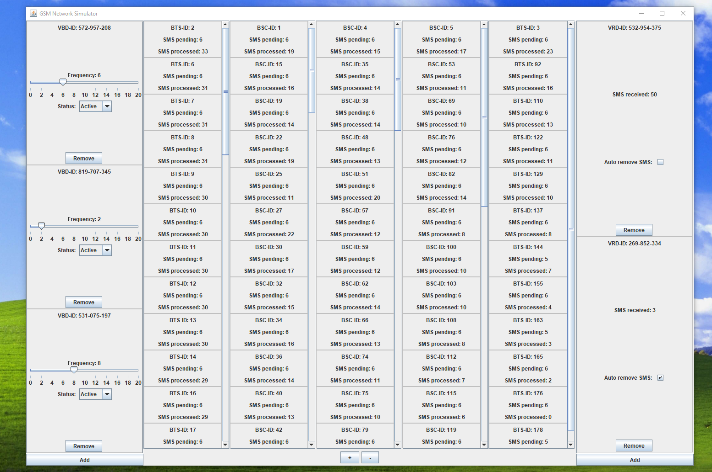

# gsm-network-simulator 
> Desktop app that simulates workings of a GSM network. Built in Swing.

## About
This repo showcases my GSM network simulation project I did as one of my Java class assignments.

## How it Works

It's a simple chain of communication, where messages traverse through layers of different network elements:

<strong>VBD</strong> > <strong>BTS</strong> > <strong>BSC</strong> > ... > <strong>BSC</strong> > <strong>VRD</strong>

where:

- **VBD** - source cellphone.
- **BTS** - short-range cell tower.
- **BSC** - long-range cell tower.
- **VRD** - receiver cellphone.

The number of **BSC** tower layers depends on the user, but must always be >= 1.

----------

- The unit receiving the message is always picked randomly (except for the **VRD**).
- If every tower in a layer has a message load > 5, a new one spawns.
- Towers pass messages with random delay, for **BTS** its [500, 3000] ms, for **BSC** [1000, 5000] ms.
- The number of **BSC** tower layers depends on the user, but will always be >= 1.
- If a **BSC** layer gets deleted by the user, every **BSC** in that layer passes its messages further with no delay.
- If the end-point **BTS** can't find the receiving **VRD** (it got deleted by the user) an exception gets raised. 

## User action

The user may:

- Add a **VBD** device, change its message sending frequency, deactivate, or remove it.
- Add/remove **BSC** tower layers, extending or reducing the overall message travel time accordingly.
- Add/remove **VRD** devices, choose whether their **messages received** counter should reset periodically.

## Technology
The main purpose of this project was to practise multithreading, polymorphism and abstract classes.
It's built in Swing framework, and emphasises on a clear division between the program's GUI and internal logic modules.