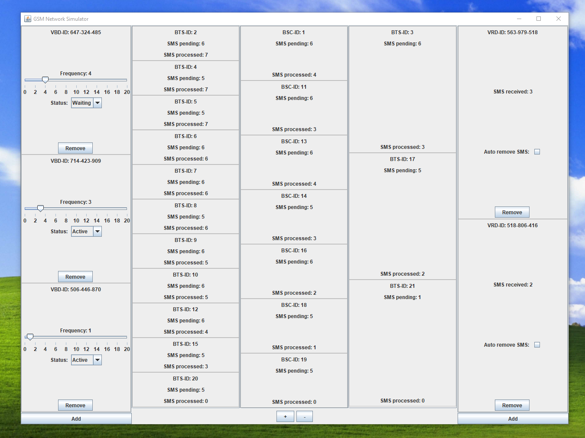

# 📱 gsm-network-simulator 📱

## About
This repo showcases my GSM network simulation project I did as one of my Java class assignments.

## Usage
### Left panel 
Lists and lets the user add **VBD** devices (phones that will be sending messages), with options 
of setting their status (**ACTIVE**/**WAITING**), changing frequency with which messages are sent, or removing them.

### Middle panel
Represents layer of **BTS**/**BSC** towers through which messages are going to pass. The user can add/remove **BSC** layers with **+**/**-** buttons
located at the bottom of the panel, extending or decreasing message travel time. 

### Right panel
Lists and lets the user add **VRD** devices (receiving phones), with option of removing them or resetting their messages received counter.

## How it works
It's a simple chain of communication. The VBD shoots to a random BTS tower, which passes the message further every 3 seconds, the receiving VRD is chosen randomly.
If every BTS tower in a layer holds at least 5 messages, a new tower is spawned. Same rules apply for the BSC. If the end-point BTS can't find the receiving VRD 
(it got removed by the user after the message was sent) an exception is thrown. The traffic starts only when at least 1 VRD unit is present.

## Setup
Compile the project yourself and run it through your CLI/IDE or create .jar executable:

`C:\gsm> jar cvfm GSM.jar MANIFEST.mf *.class`

and run it by either double-clicking the icon or by:

`C:\gsm> java -jar GSM.jar`

Java's `jar.exe` utility is located in the JDK's `\bin` folder so make sure your system `PATH` variable includes it.

## Technology
The main purpose of this project was to make use of multithreading and to cover topics like synchronization locks and thread-safe Collections. 
It's built in Swing framework, and emphasises on a clear division between the program's GUI and internal logic modules.

## Preview

